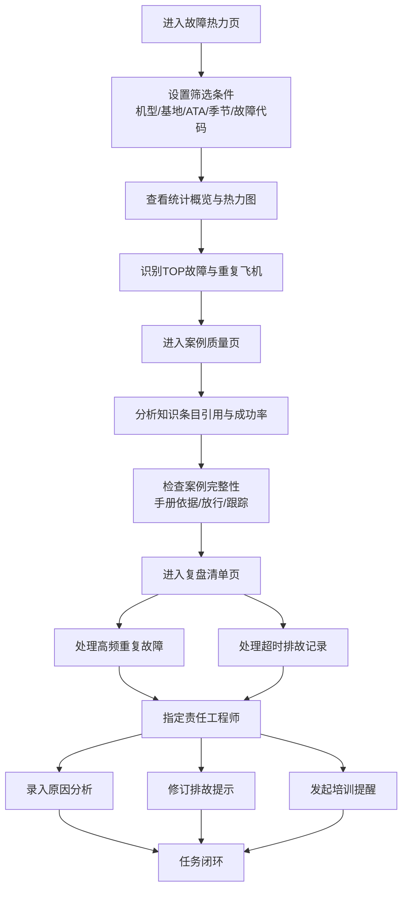

## 1. 产品概述

航线排故知识库看板是一个面向维修质量部门的数据驱动型质量管理工具，旨在通过数据分析发现可靠故障经验、识别低效排故路径，推动航线维修持续改进。

- 目标用户：维修质控人员、责任工程师、维修管理人员
- 核心价值：将知识库从被动查询工具转变为主动驱动质量改进的平台

## 2. 核心功能

### 2.1 用户角色

| 角色 | 核心权限 |
|------|----------|
| 质控人员 | 筛选查看数据、分析案例质量、发起复盘任务、指定责任工程师 |
| 责任工程师 | 补充原因分析、修订排故提示、响应培训提醒 |
| 管理人员 | 查看全局统计、审核改进措施 |

### 2.2 功能模块

1. **故障热力页**：多维度筛选器、故障统计概览、热力图展示、TOP故障列表、重复故障飞机、常用处理动作
2. **案例质量页**：知识条目引用分析、成功率评估、案例质量检查清单、缺失项告警
3. **复盘清单页**：高频重复故障清单、超时排故记录、改进任务分配、原因分析录入、培训提醒管理

### 2.3 页面详情

| 页面名称 | 模块名称 | 功能描述 |
|-----------|-------------|---------------------|
| 故障热力页 | 多维度筛选器 | 按机型、基地、ATA章节、季节、故障代码进行筛选 |
| 故障热力页 | 统计概览卡片 | 近三个月故障次数、平均停场时间、重复飞机数、常用处理动作数 |
| 故障热力页 | ATA章节热力图 | 各ATA章节故障分布热力图，颜色深浅表示故障频次 |
| 故障热力页 | TOP故障列表 | 按出现次数排序的故障清单，展示故障代码、描述、次数、平均停场时间 |
| 故障热力页 | 重复故障飞机 | 多次出现相同故障的飞机清单，展示机号、故障次数、最近发生时间 |
| 故障热力页 | 常用处理动作 | 该类故障最常采用的排故动作及成功率统计 |
| 案例质量页 | 知识条目引用分析 | 按引用次数排序的知识条目列表，展示引用次数、成功率、最近更新时间 |
| 案例质量页 | 低成功率条目 | 频繁引用但成功率低的知识条目告警列表 |
| 案例质量页 | 案例质量检查 | 缺少手册依据、放行结论、后续跟踪的案例清单 |
| 案例质量页 | 质量趋势图表 | 近三个月案例质量合格率趋势图 |
| 复盘清单页 | 高频重复故障 | 系统自动识别的重复故障清单，支持指定责任工程师 |
| 复盘清单页 | 超时排故记录 | 超过平均排故时间阈值的记录清单 |
| 复盘清单页 | 改进任务管理 | 原因分析录入、排故提示修订、培训提醒发起 |
| 复盘清单页 | 任务状态跟踪 | 待处理、处理中、已完成状态筛选与跟踪 |

## 3. 核心流程

质控人员登录系统后，首先在故障热力页通过多维度筛选器定位关注的故障类型，查看统计数据和热力图分析故障分布趋势。发现异常后进入案例质量页，检查知识条目有效性和案例完整度，识别需要改进的知识条目。每周复盘时在复盘清单页处理系统自动列出的高频重复故障和超时排故记录，逐条指定责任工程师补充原因分析、修订排故提示或发起培训提醒，形成闭环改进。

## 4. 用户界面设计

### 4.1 设计风格

- **主色调**：深空蓝 (#0A1628) 作为主背景，体现工业级专业感
- **强调色**：警示橙 (#FF6B35) 用于告警和重点数据，科技青 (#00D4AA) 用于正面指标
- **中性色**： slate灰系列用于卡片和分隔，确保数据可读性
- **按钮风格**：圆角8px，微动效阴影，hover状态有轻微上浮
- **字体**：Noto Sans SC 作为中文显示字体，配合 JetBrains Mono 用于数据展示
- **布局风格**：卡片式Dashboard布局，左侧导航 + 顶部筛选 + 内容网格
- **图标风格**：Lucide 线性图标，保持简洁专业

### 4.2 页面设计概览

| 页面名称 | 模块名称 | UI元素 |
|-----------|-------------|-------------|
| 故障热力页 | 筛选区域 | 下拉选择器、日期范围、重置/导出按钮，紧凑横向排列 |
| 故障热力页 | 统计卡片 | 4个大数字卡片，带趋势箭头和环比变化，渐变背景点缀 |
| 故障热力页 | 热力图区域 | 网格色块热力图，鼠标悬浮显示详情，颜色从浅蓝到橙红渐变 |
| 故障热力页 | 数据表格 | 带斑马纹的数据表格，支持排序，关键字段高亮 |
| 案例质量页 | 引用分析 | 条形图 + 列表混合布局，低成功率条目红色边框告警 |
| 案例质量页 | 质量检查 | 三类问题标签式展示（缺手册/缺放行/缺跟踪），带数量徽章 |
| 复盘清单页 | 任务卡片 | 可折叠任务卡片，状态标签颜色区分，右侧操作按钮组 |
| 复盘清单页 | 任务分配 | 工程师选择下拉、备注输入框、截止日期选择器 |

### 4.3 响应式

- 桌面端优先设计，主内容区最小宽度1280px
- 平板端（768px-1280px）：筛选区域折行，卡片网格变为2列
- 移动端（<768px）：侧边栏收起为汉堡菜单，卡片单列展示

### 4.4 动效设计

- 页面加载：卡片依次淡入上滑（staggered reveal，间隔80ms）
- 热力图：色块hover时轻微放大并显示tooltip
- 数据表格：行hover时背景微变，行内操作按钮淡入
- 任务卡片：展开/收起有平滑高度过渡动画
