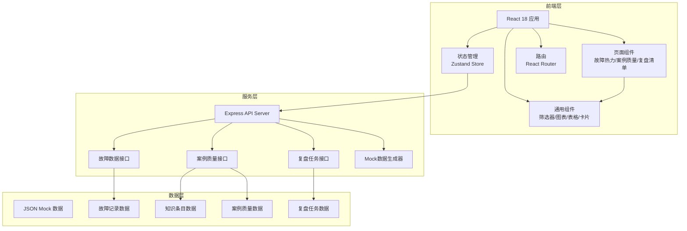
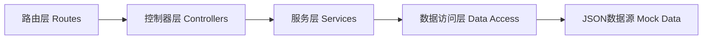
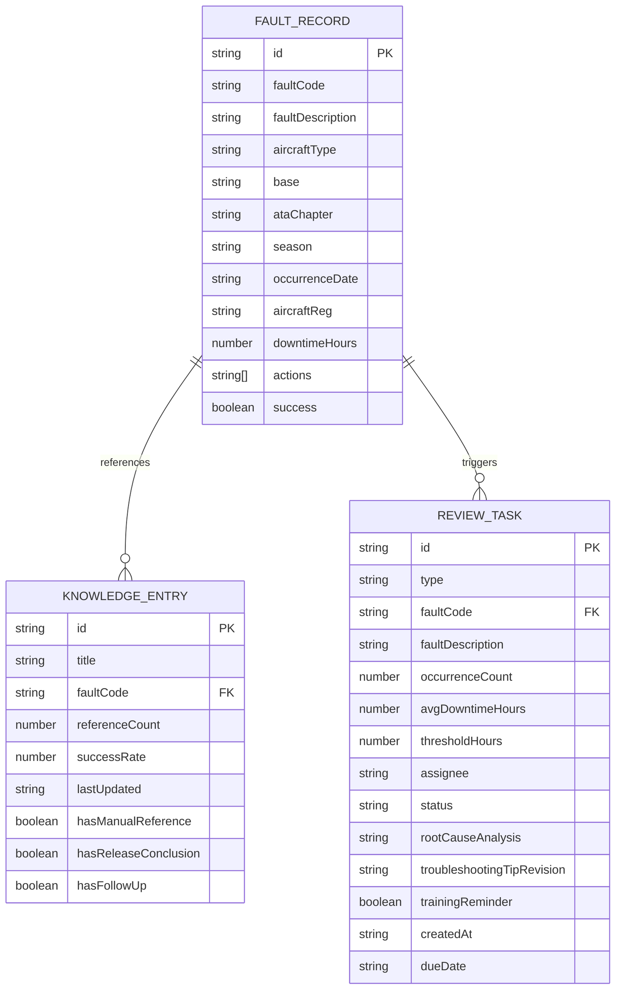

## 1. 架构设计



## 2. 技术说明

- **前端**：React@18 + TypeScript@5 + Vite@5 + TailwindCSS@3 + Zustand@4 + React Router@6 + Lucide React@0.400
- **图表库**：Recharts@2（用于趋势图、柱状图、热力图等）
- **初始化工具**：vite-init react-express-ts 模板
- **后端**：Express@4 + TypeScript
- **数据层**：本地 JSON Mock 数据，后端提供 RESTful API 接口
- **状态管理**：Zustand 管理全局筛选条件和任务状态

## 3. 路由定义

| 路由 | 用途 |
|-------|---------|
| / | 重定向到 /fault-heatmap |
| /fault-heatmap | 故障热力页面 - 故障统计与分布分析 |
| /case-quality | 案例质量页面 - 知识条目与案例质量检查 |
| /review-checklist | 复盘清单页面 - 改进任务管理与分配 |

## 4. API 定义

### 4.1 类型定义

```typescript
interface FaultRecord {
  id: string;
  faultCode: string;
  faultDescription: string;
  aircraftType: string;
  base: string;
  ataChapter: string;
  ataChapterName: string;
  season: string;
  occurrenceDate: string;
  aircraftReg: string;
  downtimeHours: number;
  actions: string[];
  success: boolean;
}

interface KnowledgeEntry {
  id: string;
  title: string;
  faultCode: string;
  referenceCount: number;
  successRate: number;
  lastUpdated: string;
  hasManualReference: boolean;
  hasReleaseConclusion: boolean;
  hasFollowUp: boolean;
}

interface ReviewTask {
  id: string;
  type: 'repeat_fault' | 'timeout_troubleshoot';
  faultCode: string;
  faultDescription: string;
  occurrenceCount: number;
  avgDowntimeHours: number;
  thresholdHours?: number;
  assignee: string | null;
  status: 'pending' | 'in_progress' | 'completed';
  rootCauseAnalysis: string | null;
  troubleshootingTipRevision: string | null;
  trainingReminder: boolean;
  createdAt: string;
  dueDate: string | null;
}

interface FilterState {
  aircraftType: string | null;
  base: string | null;
  ataChapter: string | null;
  season: string | null;
  faultCode: string | null;
  dateRange: { start: string; end: string };
}
```

### 4.2 接口列表

| 方法 | 路径 | 用途 |
|------|------|------|
| GET | /api/faults | 获取故障记录列表（支持筛选参数） |
| GET | /api/faults/statistics | 获取故障统计概览数据 |
| GET | /api/faults/heatmap | 获取ATA章节热力图数据 |
| GET | /api/faults/top | 获取TOP故障列表 |
| GET | /api/faults/repeat-aircraft | 获取重复故障飞机列表 |
| GET | /api/faults/common-actions | 获取常用处理动作统计 |
| GET | /api/knowledge/entries | 获取知识条目列表 |
| GET | /api/knowledge/low-success-rate | 获取低成功率知识条目 |
| GET | /api/knowledge/quality-issues | 获取案例质量问题列表 |
| GET | /api/review/tasks | 获取复盘任务列表 |
| POST | /api/review/tasks/:id/assign | 分配任务给工程师 |
| PUT | /api/review/tasks/:id | 更新任务内容（原因分析/排故提示/培训提醒） |
| GET | /api/options/aircraft-types | 获取机型选项 |
| GET | /api/options/bases | 获取基地选项 |
| GET | /api/options/ata-chapters | 获取ATA章节选项 |

## 5. 服务端架构



- **Routes**：定义API路由和请求参数解析
- **Controllers**：处理HTTP请求，参数校验，响应格式化
- **Services**：业务逻辑处理，数据聚合计算
- **Data Access**：统一的JSON数据读写接口

## 6. 数据模型

### 6.1 实体关系



### 6.2 数据初始化

使用 Mock 数据生成器创建以下测试数据：
- 200+ 条故障记录，覆盖5种机型、8个基地、20个ATA章节、4个季节
- 50+ 条知识条目，包含不同引用次数和成功率
- 30+ 个复盘任务，涵盖待处理、处理中、已完成三种状态
